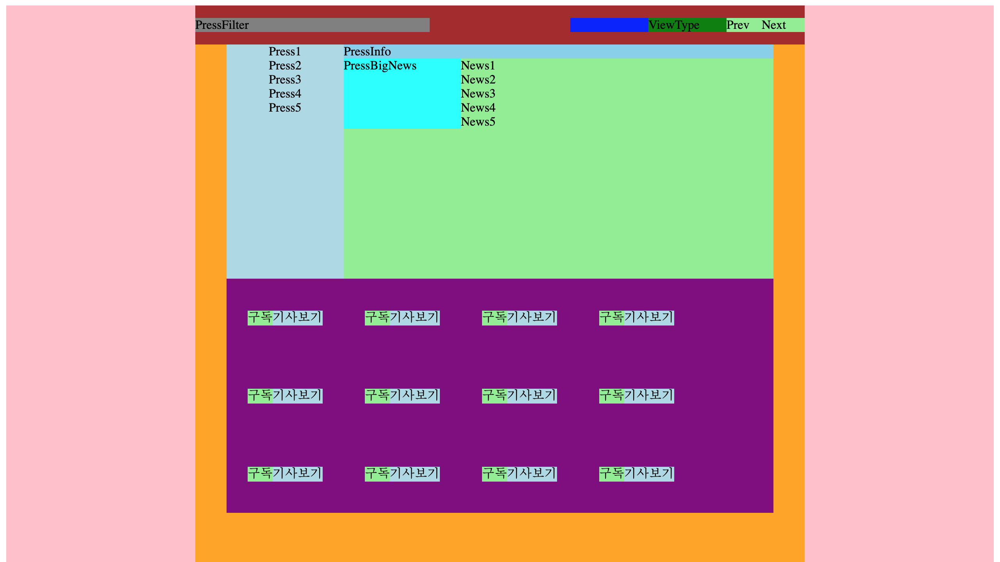

# fe-set-newsstand-react-devheedoo

## Config

> without CRA

- Yarn
- Babel
- Webpack
- React
- Styled Component

## Install

```bash
$ yarn install
```

## Build

```bash
$ yarn build
```

## Start

```bash
$ yarn start
```

## History

### 1. Babel, Webpack, React

### 2. Styled Components



### 3. Implement Subsciption

```react
// App.js
const [pressFilter, setPressFilter] = useState(constants.PRESS_FILTER_ALL);
const [viewType, setViewType] = useState(constants.VIEW_TYPE_LIST);
const [pressIndex, setPressIndex] = useState(0);
const [page, setPage] = useState(0);
const [subscription, dispatchSubscription] = useReducer(subscriptionReducer, [
{ id: '055' },
{ id: '057' },
{ id: '073' },
]);
const [pressData, setPressData] = useState(pressListData);
```


